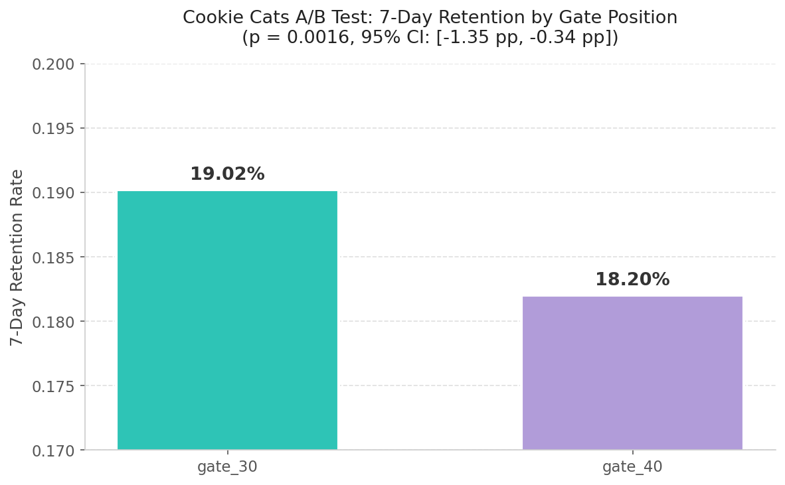

# Cookie Cats — A/B Test Analysis

An A/B test analysis on a real mobile puzzle game dataset (~90,000 players),
examining whether moving a level-progression "gate" from level 30 to level 40
would improve 7-day player retention.

## TL;DR

Moving the gate from level 30 to level 40 caused a **statistically significant
0.82 percentage point drop** in 7-day retention (p = 0.0016). Counter to product
intuition, **earlier friction kept more players coming back**.

## The Question

Cookie Cats places a "gate" at a fixed level — a forced wait, ad, or purchase
that blocks further play. The product team hypothesized that **delaying** the
gate from level 30 to level 40 would improve retention by letting players bond
with the game before hitting friction. This analysis tests that hypothesis.

## Method

- **Sample:** ~90,000 players randomly assigned at install
- **Groups:** `gate_30` (control, gate at level 30) vs `gate_40` (treatment, gate at level 40)
- **Metric:** 7-day retention — did the player return to the app 7 days after install? (binary)
- **Test:** Two-proportion z-test, α = 0.05
- **Uncertainty quantification:** 2,000-iteration bootstrap 95% confidence interval

## Results

| Metric | gate_30 | gate_40 |
|---|---|---|
| 7-day retention | **19.02%** | 18.20% |

| Statistic | Value |
|---|---|
| Absolute difference | −0.82 pp |
| Relative lift | −4.31% |
| Z-statistic | 3.16 |
| **P-value** | **0.0016** |
| **95% bootstrap CI** | **[−1.35 pp, −0.34 pp]** |

The 95% CI excludes zero, independently confirming the effect is real.

## Conclusion

The team's "delay the friction" hypothesis was **wrong**. The earlier gate
produced higher retention. The likely mechanism: a forced break at the
earlier gate creates a return-loop habit — players hit the gate, take a
break, and come back to resume. Pushed too late, many players drift off
before they ever build that loop.

**Recommendation:** keep the gate at level 30.

## What I'd Explore Next

- Segment by `sum_gamerounds` to see whether the gate effect differs between casual vs. highly engaged players.
- Run a power analysis to determine the minimum sample size needed to detect smaller effects in future tests.
- Look at `retention_1` (1-day retention) to see if the effect appears earlier in the funnel or only at 7 days.

## Stack

`Python` · `pandas` · `numpy` · `scipy` · `statsmodels` · `matplotlib` · `kagglehub`

## Reproduce

1. Clone this repo.
2. Open `cookie_cats_ab_test.ipynb` in Google Colab.
3. Add your Kaggle API token to Colab Secrets as `KAGGLE_API_TOKEN`.
4. Run all cells.

## Data

[Mobile Games AB Testing — Cookie Cats](https://www.kaggle.com/datasets/yufengsui/mobile-games-ab-testing) (Kaggle).
